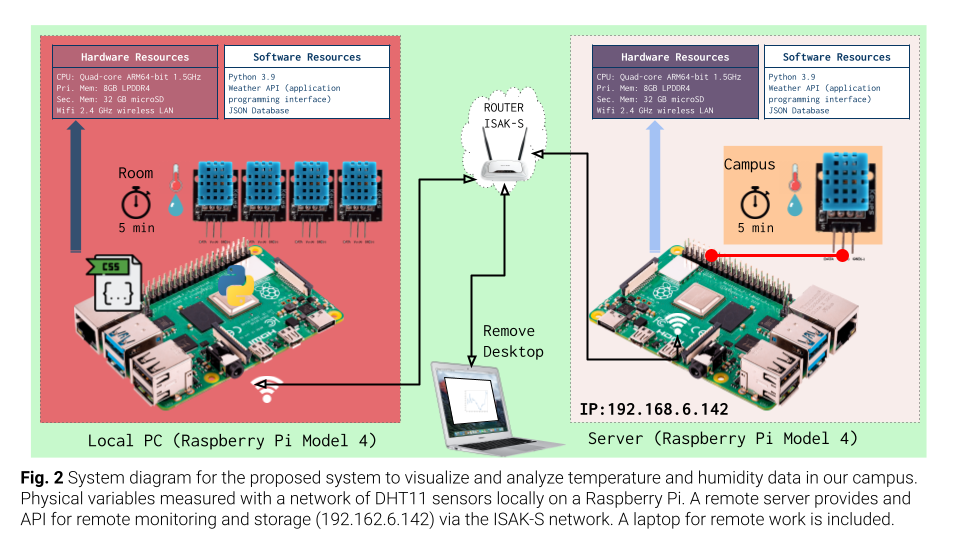
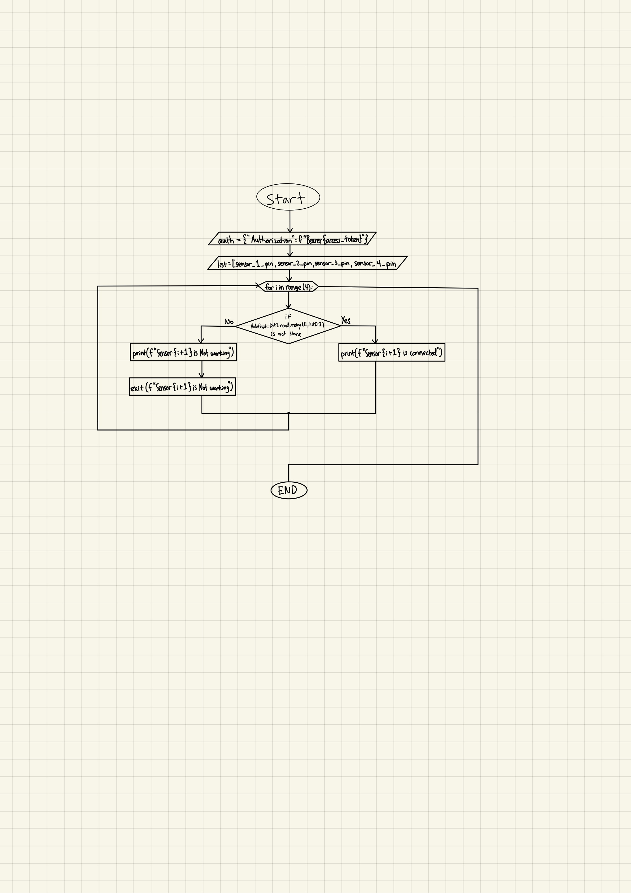
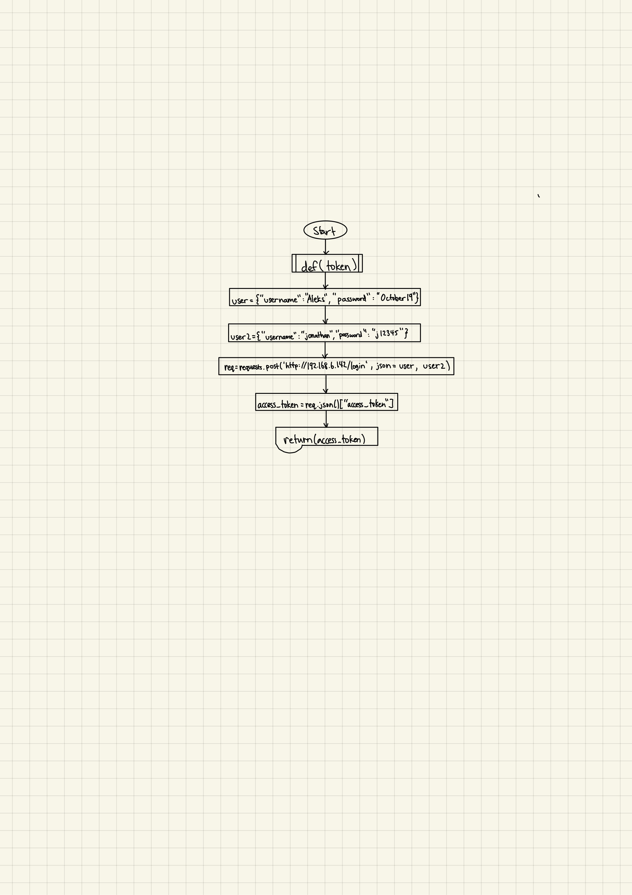
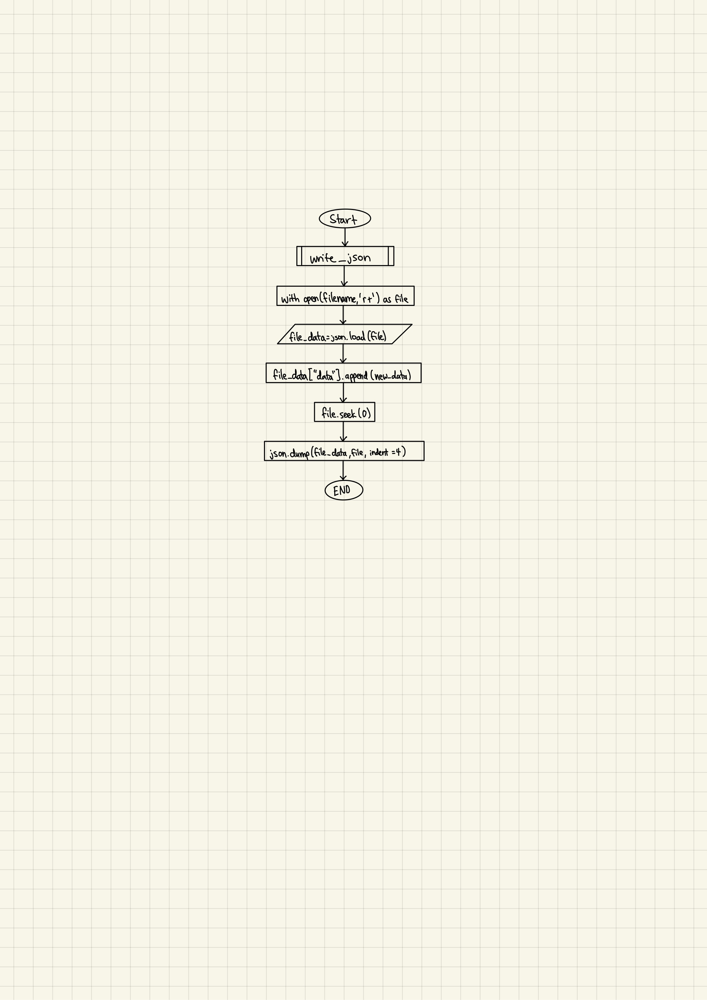

# Unit 2: A Distributed Weather Station for ISAK

# Criteria A: Planning

## Problem definition
The health center is in urgent need to solve a fast-growing problem at ISAK. Due to unoptimal humidity and temperature of the student rooms, ISAK students have been visiting nurses a lot more frequently with the issues related to soar throat. The nurses believe that the reasoning behind students sore throats is because of the humidity and temperature levels inside of student rooms. The nurses want a remote server that they can access online to check the different humidity and temperature levels in the student doorms at different times throughout the day, and compare it to the optimal levels, as well as temperature and humidity levels outside. 

## Success Criteria

1. The solution provides a visual representation of the Humidity and Temperature values inside a dormitory (Local) and outside the house (Remote) for a period of minimum 48 hours. 
1. The local variables will be measure using a set of 4 sensors around the dormitory.
2. The solution provides a mathematical modelling for the Humidity and Temperature levels for each Local and Remote locations. (both lineal and non-lineal model)
3. The solution provides a comparative analysis for the Humidity and Temperature levels for each Local and Remote locations including mean, standad deviation, minimum, maximum, and median.
4. The Local samples are stored in a csv file and posted to the remote server.
5. Create a prediction the subsequent 12 hours for both temperature and humidity.
6. A poster summarizing the visual representations, model and analysis is created and communicated.

## Design Statement 
Our team will create a device and program that will calculate both humiditiy and temperature in a room of a residential house on campus. To do this, we will use a Raspberry Pi 4 and four DHT_11 sensors to collect the humidity and temperature. The program will upload the collected data onto a server in real-time to reinforce the reliability and validity of our calculated data. We will use the device to record the humidity and temperature inside of a room for 48 hours, and the nurses on campus will be able to access the data through an online server anytime using a granted access token. Further, the nurses can use the data collected to compare to their information on optimal humidity and temperature. This project will take approximately 4 weeks and will be evaluated according to the criteria set above.


## Rationale for Proposed Solution
Considering the client requirements an adequate solution includes a low cost sensing device for humidity and temperature and a custom data script that process and anaysis the samples acquired. For a low cost sensing device an adequate alternative is the DHT11 sensor[1] which is offered online for less than 5 USD and provides adequare precision and range for the client requirements (Temperature Range: 0°C to 50°C, Humidity Range: 20% to 90%). Similar devices such as the DHT22, AHT20 or the AM2301B [2] have higher specifications, however the DHT11 uses a simple serial communication (SPI) rather than more eleborated protocols such as the I2C used by the alternatives. For the range, precision and accuracy required in this applicaiton the DHT11 provides the best compromise. Connecting the DHT11 sensor to a computer requires a device that provides a Serial Port communication. A cheap and often used alternative for prototyping is the Arduino UNO microcontroller [3]. "Arduino is an open-source electronics platform based on easy-to-use hardware and software"[4]. In additon to the low cost of the Arduino (< 6USD), this devide is programable and expandable[1]. Other alternatives include diffeerent versions of the original Arduino but their size and price make them a less adequate solution.

Considering the budgetary constrains of the client and the hardware requirements, the software tool that I proposed for this solution is Python. Python is open source, it is mature and supported in mutiple platforms (platform-independent) including macOS, Windows, Linux and can also be used to program the Arduino microprocessor[5][6]. In comparison to the alternative C or C++, which share similar features, Python is a High level programming language (HLL) with high abstraction [7]. For example, memory management is automatic in Python whereas it is responsability of the C/C++ developer to allocate and free up memory [7], this could result in faster applications but also memory problems. In addition a HLL language will allow me and future developers extend the solution or solve issues proptly.

# Criteria B: Design



**Fig.2** shows the system diagram for the proposed solution (**HL**). The indoor variables will be measured using a Raspberry PI and four DHT11 sensors located inside a room. Four sensors are used to determine more precisely the physical values and include measurement uncertainty. The outdoor variables will be requested to the remote server using a GET request to the API of the server at ```192.168.6.147/readings```. The local values are stored in a CSV database locally and POST to the server using the API and TOKEN authentication. A laptop computer is used for remotely controlling the local Rasberry Pi using a Dekptop sharing application (VNC Viewer). (Optional) Data from the local raspberry is downloaded to the laptop for analysis and processing.

### List of materials:

1 x Rasberry Pi model 4

4 x DHT-11 sensor

1x Breadboard

6 x Long Wires

8 x Small Connectors

A Remote desktop


## Record of Tasks
| Task No | Planned Action                                                | Planned Outcome                                                                                                 | Time estimate | Target completion date | Criterion |
|---------|---------------------------------------------------------------|-----------------------------------------------------------------------------------------------------------------|---------------|------------------------|-----------|
| 1       | Brainstorm and write the problem definition | A clear problem definition on Github   | 15 minutes         | Nov 22    | A
| 2        | Write the list of  materials  |  Have a full list of materials    |  5 minutes | Nov 24   | B |
| 3       | Brainstorm and write the design statement | A clear design statement that suits the need of the client | 20 minutes  |  Nov 29  | A |
| 4        | Write the Rationale for proposed solution | A clear justification that suits the client and developer.  | 10 minutes  |  Nov 29  | A |
| 5        |   Construct the device used to collect temperature and humidity data  |  A working device that accurately collects temperature and humidity data | 45 minutes  |  Nov 30  | B |
| 6        |   Create the code needed to accurately display data collected from the device  | The program continously collects data and stores it in a log over time.  | 20 minutes  |  Nov 30  | B |
| 7        | Create a code for signing up on the server |  Allows the user to create a username and password for the server | 30 minutes  |  Dec 2  | B |
| 8        |   Create a code for logging in on the server  | Allows the user to log into their account they had created  | 30 miinutes  |  Dec 2  | B |
|9         | Create 8 seperate servers, 4 for both humidity and temperature levels. | Setup 8 servers to which the data will be automatically sent every 5 minutes for 48 hours | 15 min| Dec 4| B|
|10        | Make a code for collecting the data and sending it to the server | Establish a connection to the server and send the obtained data|25min |Dec 6 | B | 
|11        | Make a code for getting the data in the refined format and send it to the .csv file, and start with data collecting | Start data collecting by making the code for CSV file data input |40min| Dec 7| B|
|12| Implement better coding practices in the code| Have a more efficent code by using loops instead of multiple if statements, thus making the program faster and more organized|20min|Dec 9| B |
## Test Plan

| Test Type | Target | Procedure | Expected Outcome |
|-----------|--------|-----------|------------------|
| Functional | 

3 functional 3 non-functional 

ideas :

testing creating acount to acces the api

testing connection to the api


## Flow Diagrams



Fig.3 In this flow diagram above, it shows the function that checks if the sensor is connected and working. It checks if each sensor is collecting data, and if it does, it will print a message that tells the user that sensor is connected. However, if the sensor is not connected, it will print an error message displaying that the sensor is not working. It works by using a for loop and if-statement. The if-statement runs 4 times to check if all 4 sensors are connected.



Fig.4 In this flow diagram above, it shows the function that allows the user to gain an access token through the remote server using a username and password. It sends a request to the remote server, and inputs the credentials, and if the account exists and the crendtials are accurate within the database of the server, it returns an access token to the user which will allow them gain access to the data (readings) collected.



Fig.5 In this flow diagram above, it shows the function that writes the collected readings into a JSON file. The file is first opened and loaded, then the new data is appended into the existing file of readings. Further after adding the readings, we use the json. dump() method which converts the python object into an equivalent JSON object and store the result into a JSON file at the working directory. 

# Criteria C: Development

## List of techniques used
Using functions

For/while loops

PIN connection validation

File reading

Writing in a csv file

Loging to the Api servers by creating an account and using an access token

Sending data to Api servers

Reading data from the Api server

Plotting graphs by using mathplot.lib and using the aquired data (+ getting quadratic formula)

Connecting and setting up rasberrry pi and dht11 sensors

Concuding data by calculating median,mean, maximum,minimum of the data collected


## Development
 Parts of the code with the reasoining behind them
 

# Criteria D: Functionality

A 7 min video demonstrating the proposed solution with narration

# Citations
1. Industries, Adafruit. “DHT11 Basic Temperature-Humidity Sensor + Extras.” Adafruit Industries Blog RSS, https://www.adafruit.com/product/386. 
2. Nelson, Carter. “Modern Replacements for DHT11 and dht22 Sensors.” Adafruit Learning System, https://learn.adafruit.com/modern-replacements-for-dht11-dht22-sensors/what-are-better-alternatives.   
3. “How to Connect dht11 Sensor with Arduino Uno.” Arduino Project Hub, https://create.arduino.cc/projecthub/pibots555/how-to-connect-dht11-sensor-with-arduino-uno-f4d239.  
4. Team, The Arduino. “What Is Arduino?: Arduino Documentation.” Arduino Documentation | Arduino Documentation, https://docs.arduino.cc/learn/starting-guide/whats-arduino.  
5. Tino. “Tino/PyFirmata: Python Interface for the Firmata (Http://Firmata.org/) Protocol. It Is Compliant with Firmata 2.1. Any Help with Updating to 2.2 Is Welcome. the Capability Query Is Implemented, but the Pin State Query Feature Not Yet.” GitHub, https://github.com/tino/pyFirmata. 
6. Python Geeks. “Advantages of Python: Disadvantages of Python.” Python Geeks, 26 June 2021, https://pythongeeks.org/advantages-disadvantages-of-python/. 
7. Real Python. “Python vs C++: Selecting the Right Tool for the Job.” Real Python, Real Python, 19 June 2021, https://realpython.com/python-vs-cpp/#memory-management. 
8. BCR, Chris @. “Setting up a Cron Job on the Raspberry Pi.” BC Robotics, 5 Feb. 2022, https://bc-robotics.com/tutorials/setting-cron-job-raspberry-pi/. 
