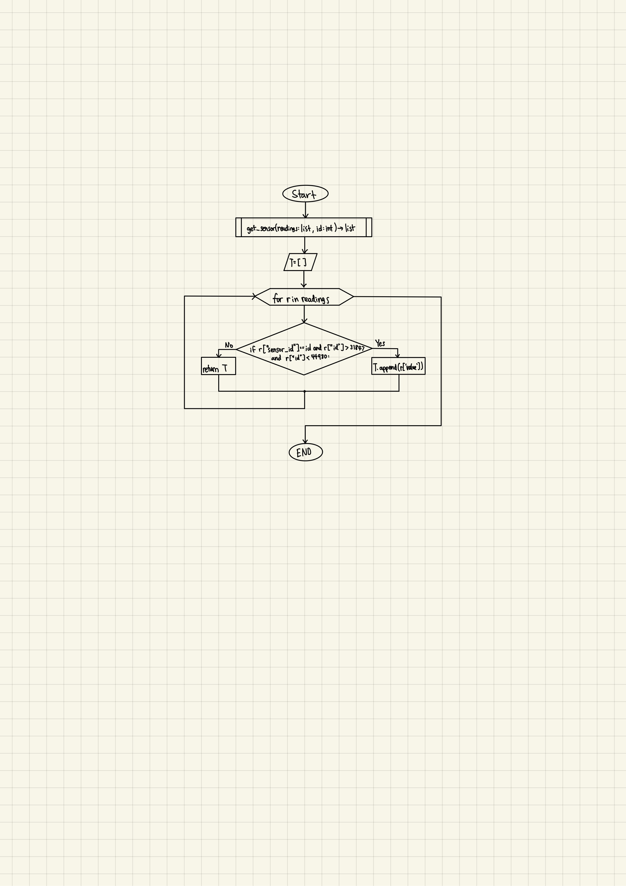

# Unit 2: A Distributed Weather Station for ISAK

# Criteria A: Planning

## Problem definition
The health center is in urgent need to solve a fast-growing problem at ISAK. Due to unoptimal humidity and temperature of the student rooms, ISAK students have been visiting nurses a lot more frequently with the issues related to soar throat. The nurses believe that the reasoning behind students sore throats is because of the humidity and temperature levels inside of student rooms. The nurses want a remote server that they can access online to check the different humidity and temperature levels in the student doorms at different times throughout the day, and compare it to the optimal levels, as well as temperature and humidity levels outside. 

## Success Criteria

1. The solution provides a visual representation of the Humidity and Temperature values inside a dormitory (Local) and outside the house (Remote) for a period of minimum 48 hours. 
1. The local variables will be measure using a set of 4 sensors around the dormitory.
2. The solution provides a mathematical modelling for the Humidity and Temperature levels for each Local and Remote locations. (both lineal and non-lineal model)
3. The solution provides a comparative analysis for the Humidity and Temperature levels for each Local and Remote locations including mean, standad deviation, minimum, maximum, and median.
4. The Local samples are stored in a csv file and posted to the remote server.
5. Create a prediction the subsequent 12 hours for both temperature and humidity.
6. A poster summarizing the visual representations, model and analysis is created and communicated.

## Design Statement 
Our team will create a device and program that will calculate both humiditiy and temperature in a room of a residential house on campus. To do this, we will use a Raspberry Pi 4 and four DHT_11 sensors to collect the humidity and temperature. The program will upload the collected data onto a server in real-time to reinforce the reliability and validity of our calculated data. We will use the device to record the humidity and temperature inside of a room for 48 hours, and the nurses on campus will be able to access the data through an online server anytime using a granted access token. Further, the nurses can use the data collected to compare to their information on optimal humidity and temperature. This project will take approximately 4 weeks and will be evaluated according to the criteria set above.


## Rationale for Proposed Solution
Considering the client requirements an adequate solution includes a low cost sensing device for humidity and temperature and a custom data script that process and anaysis the samples acquired. For a low cost sensing device an adequate alternative is the DHT11 sensor[1] which is offered online for less than 5 USD and provides adequare precision and range for the client requirements (Temperature Range: 0°C to 50°C, Humidity Range: 20% to 90%). Similar devices such as the DHT22, AHT20 or the AM2301B [2] have higher specifications, however the DHT11 uses a simple serial communication (SPI) rather than more eleborated protocols such as the I2C used by the alternatives. For the range, precision and accuracy required in this applicaiton the DHT11 provides the best compromise. Connecting the DHT11 sensor to a computer requires a device that provides a Serial Port communication. A cheap and often used alternative for prototyping is the Arduino UNO microcontroller [3]. "Arduino is an open-source electronics platform based on easy-to-use hardware and software"[4]. In additon to the low cost of the Arduino (< 6USD), this devide is programable and expandable[1]. Other alternatives include diffeerent versions of the original Arduino but their size and price make them a less adequate solution.

Considering the budgetary constrains of the client and the hardware requirements, the software tool that I proposed for this solution is Python. Python is open source, it is mature and supported in mutiple platforms (platform-independent) including macOS, Windows, Linux and can also be used to program the Arduino microprocessor[5][6]. In comparison to the alternative C or C++, which share similar features, Python is a High level programming language (HLL) with high abstraction [7]. For example, memory management is automatic in Python whereas it is responsability of the C/C++ developer to allocate and free up memory [7], this could result in faster applications but also memory problems. In addition a HLL language will allow me and future developers extend the solution or solve issues proptly.

# Criteria B: Design


**Fig.2** shows the system diagram for the proposed solution (**HL**). The indoor variables will be measured using a Raspberry PI and four DHT11 sensors located inside a room. Four sensors are used to determine more precisely the physical values and include measurement uncertainty. The outdoor variables will be requested to the remote server using a GET request to the API of the server at ```192.168.6.147/readings```. The local values are stored in a CSV database locally and POST to the server using the API and TOKEN authentication. A laptop computer is used for remotely controlling the local Rasberry Pi using a Dekptop sharing application (VNC Viewer). (Optional) Data from the local raspberry is downloaded to the laptop for analysis and processing.

### List of materials:

1 x Rasberry Pi model 4

4 x DHT-11 sensor

1x Breadboard

6 x Long Wires

8 x Small Connectors

A Remote desktop

1 x Usb cable to connect the rasberry pi to a power source

## Test Plan

| Test Type | Target | Procedure | Expected Outcome |
|-----------|--------|-----------|------------------|
| Functional: Integrational testing | Login: Access Token | 1. Use the function (token). 2. Have the set credentials (username and password) in the function. | If the username and passwords match with the credentials from the remote server, the code will return an access token, which will allow the user to access the remote server that includes all the collected data (readings). If the username and password entered does not match any of the existing crendentials, the access token will not be granted to the user. |
| Functional: Integrational testing | 
| Functional: Integrational testing | 
| Non-functional: Load testing | Testing if the program has little lag or glitches due to the amount of time the program is ran for (48 hours). Additionally, see if continously added data (readings) influence the proccessing of the program. | 1. Run the program. 2. Continously check up on the code, every 2-3 hours. | All data is up to date, and the program is 
| Non-functional: Response time |
| Non-functional：Code review | Reviewing if the code has adequate comments, function name, and variable name.As this reviews the quality of the code, there are no inputs. | The procedure included a review of the code from a external developer who is not familiar with techniques used in it. The developer then gave feedback on which parts are not understandable and names of which variables are not logical when looking at the purpose of the variable.|The code will include comments explaining what is occuring within the code. Furthermore, the names of variables are simple and easy to understand. |


## Record of Tasks
| Task No | Planned Action                                                | Planned Outcome                                                                                                 | Time estimate | Target completion date | Criterion |
|---------|---------------------------------------------------------------|-----------------------------------------------------------------------------------------------------------------|---------------|------------------------|-----------|
|1| Brainstorm and write the problem definition | A clear problem definition on Github   | 15 minutes         | Nov 22    | A
|2| Write the list of  materials  |  Have a full list of materials    |  5 minutes | Nov 24   | B |
|3| Brainstorm and write the design statement | A clear design statement that suits the need of the client | 20 minutes  |  Nov 29  | A |
|4| Write the Rationale for proposed solution | A clear justification that suits the client and developer.  | 10 minutes  |  Nov 29  | A |
|5|   Construct the device used to collect temperature and humidity data  |  A working device that accurately collects temperature and humidity data | 45 minutes  |  Nov 30  | B |
|6|   Create the code needed to accurately display data collected from the device  | The program continously collects data and stores it in a log over time.  | 20 minutes  |  Nov 30  | B |
|7| Create a code for signing up on the server |  Allows the user to create a username and password for the server | 30 minutes  |  Dec 2  | B |
|8|   Create a code for logging in on the server  | Allows the user to log into their account they had created  | 30 miinutes  |  Dec 2  | B |
|9| Create 8 seperate servers, 4 for both humidity and temperature levels. | Setup 8 servers to which the data will be automatically sent every 5 minutes for 48 hours | 15 min| Dec 4| B|
|10| Make a code for collecting the data and sending it to the server | Establish a connection to the server and send the obtained data|25min |Dec 6 | B | 
|11| Make a code for getting the data in the refined format and send it to the .csv file, and start with data collecting | Start data collecting by making the code for CSV file data input |40min| Dec 7| B|
|12| Implement better coding practices in the code| Have a more efficent code by using loops instead of multiple if statements, thus making the program faster and more organized|20min|Dec 9| B |
|13| Draw and describe the flow diagrams | Flow diagrams for different parts of the solution along with a brief explanation | 45 minutes | Dec 9 | B |
|14| Write the test plan (3 functional and 3 non-functional) | Procedures in which one should take to test the program and descriptions of the expected outcome of each test is on Github | 45 minutes | Dec 9 | B |
|15| Work on the development part in criteria C related to the criteria number 5|explained CT and process behind the data recording in a .csv file and posting it on the server| 20 min| Dec 10| C|
|16|Extract the reading from the remote server outside during the 48 hours when the recording inside the studentroom took place| Have apropriate range of data from the outside sensor (done by checking if the id of the reading is a part of the certain range compatable with id-s during the 48 hours when we collected recordings inside)|35 min|Dec 10| B |
|17| Work on the development part in criteria C related to the criteria number 2|Show the rasberry pi and the 4 sensors we used as well as the different locations inside the room from which the temperature and humidity were measured| 10 min| Dec 10| C|
|18|Code the program that plots graphs containg mean temp and humidity, and individual recordings from all the sensors|Program will produce the graphs that will be used on the poster and in section C|60min|Dec 10 |B|
|19|Code the program that plots graphs comparison of the outside and inside the room humidity and temperature during the 48hour recording|By using quadratic equations, plot a graph which is both visually pleasing and practical in the way that the client can see he relation between the outside and inside temperature and humidity|30 min| Dec 11|B|
|20|Work on the development part in criteria C related to the criteria number 1|Have a visual represntation  with an explanation of the data which fulfills the criteria 1 stated by the client|20 min|Dec 11|C|
|21|Code the program that plots graph predicting the weather and humidity of the room during subsequent 12 hours|Have a program that will create a graph that clearly indicates predicted numbers for the following 12 hours using the formula and CT that is given in criteria C #6 criteria|40min|Dec 11|B|
|22|Work on the development part in criteria C related to the criteria number 6| Have clear visual represntation with an explanation and CT behind the prediction of the data in the subsequent 12 hours|30 min|Dec 11|C|


## Flow Diagrams


Fig 3. In this flow diagram above, it shows the function that checks if the sensor is connected and working. It checks if each sensor is collecting data, and if it does, it will print a message that tells the user that sensor is connected. However, if the sensor is not connected, it will print an error message displaying that the sensor is not working. It works by using a for loop and if-statement. The if-statement runs 4 times to check if all 4 sensors are connected.


Fig 4. In this flow diagram above, it shows the function that allows the user to gain an access token through the remote server using a username and password. It sends a request to the remote server, and inputs the credentials, and if the account exists and the crendtials are accurate within the database of the server, it returns an access token to the user which will allow them gain access to the data (readings) collected.



Fig 5. In this flow diagram above, it shows the function that extracts the data from the sensors with an id within the appropriate range. The range of the sensor_ids that were used while collecting temperature and humidity data during the 48 hour procedure of data collecting inside the room. By using this function only the relavant data during that time will be used and later on presented, preventing any mistakes in the data corelation between the readings inside and outside the room.

# Criteria C: Development

## List of techniques used
Using functions

For/while loops

Defining and using functions 

PIN connection validation

File reading

Writing in a csv file

Loging to the Api servers by creating an account and using an access token

Sending data to Api servers

Reading data from the Api server

Plotting graphs by using mathplot.lib and using the aquired data (+ getting quadratic formula)


## Development


### 1 The client wants The solution that provides a visual representation of the Humidity and Temperature values inside a dormitory (Local) and outside the house (Remote) for a period of minimum 48 hours.
> By using matplot.lib we have visually presented mean temperature and humidity inside the room during the 48 hours as well as readings from all the sensors individually. For the mean readings of temperature and humidity inside(pic 1.1 and 1.2) we used plt.bar and plt.stem so that the data will be presented in the way which makes it easier to visually understand the change in the temperature and humidity througout the day.

>   Outside readings will be visually compared with the mean of the readings inside the dorm. We presented the data through using  quadratic equation, as the lines that way are much more visible and the client can clearly see the behaviour of the data changing due to the time of the day. This way we also allowed the client to easily see how the outside weather affects the humidity and temperature inside the room. With all these features we have presented a reliable solution to the request stated in criteria number 1 of the client.

#### Picture 1.1 shows mean humidity in the dorm and the humidity readings from all sensors individually.

#### Picture 1.2 shows mean temperature in the dorm and the temperature readings from all sensors individually.

#### Picture 1.3 shows the relation between humidity and temperature inside the room and outside 


 

###  2 The client requested that the local variables will be measured using a set of 4 sensors around the dormitory.
> We used rasberry pi 4 and 4 DHT 11 sensors to collect the data. By collecting it from multiple locations the diversity in data was achieved, allowing better representation of the humidity and temperature in thhe rooms was possible. The locations were changed during the 48 hour period, with location 1 being the main one where the majority of data was recorded. This is because it is distanced further from the window than location 1 but closer than location 3, so the data gives us what is closest to an avarage of the whole room. By doing this we fulfilled client's request for criteria 2.


*Screenshot of for sensors used,picture of the model, picture of the rasberry pi and where it was moved during recordings

### 3 The solution provides a mathematical modelling for the Humidity and Temperature levels for each Local and Remote locations. (both lineal and non-lineal model)

*Quadratic function graph for both remote and local

### 4 The solution provides a comparative analysis for the Humidity and Temperature levels for each Local and Remote locations including mean, standad deviation, minimum, maximum, and median.

*Screenshots of the graphs

## 5 The client wanted the Local samples stored in a .csv file and posted to the remote server. We did this by uploading recordings to the server using the following code

> We used the following function to send the data to the server y using /reading/new endpoint on the server API. It allowed us to create a record for a sensor in the server. The user logged in is the owner of the record. 

```.py
def senddata(value, sensor_id):
    new_record ={"datetime":str(datetime.isoformat(datetime.now())),"sensor_id":sensor_id, "value":value}
    r = requests.post('http://192.168.6.142/reading/new', json=new_record, headers=auth)
```

> The client also wanted us to store the data into a csv file which we did, using the code below. We used get_readings function in the way which allowed us to first send data from all the sensors to the server, and then store the data in the variable which would get returned in the endo of the function allowing us to store it in the .csv file using poen f and f.write features.
```.py
def get_readings():
    humidity1, temperature1 = Adafruit_DHT.read_retry(11, sensor_1_pin)
    senddata(temperature1, sensor1tempid)
    senddata(humidity1, sensor1humidityid)
    humidity2, temperature2 = Adafruit_DHT.read_retry(11, sensor_2_pin)
    senddata(temperature2, sensor2tempid)
    senddata(humidity2, sensor2humidityid)
    humidity3, temperature3 = Adafruit_DHT.read_retry(11, sensor_3_pin)
    senddata(temperature3, sensor3tempid)
    senddata(humidity3, sensor3humidityid)
    humidity4, temperature4 = Adafruit_DHT.read_retry(11, sensor_4_pin)
    senddata(temperature4, sensor4tempid)
    senddata(humidity4, sensor4humidityid)

    average_temp = (temperature1 + temperature2 + temperature3 + temperature4) / 4
    average_humidity = (humidity1 + humidity2 + humidity3 + humidity4) / 4
    median_temp = statistics.median([temperature1, temperature2, temperature3, temperature4])
    median_humidity = statistics.median([humidity1, humidity2, humidity3, humidity4])
    reading =(f"{temperature1},{humidity1},{temperature2},{humidity2},{temperature3},{humidity3},{temperature4},{humidity4},{datetime.isoformat(datetime.now())},{median_temp},{median_humidity}")
    return (reading)

reading=get_readings()
with open("/home/dev/readings.csv","a") as f:
    f.write(f"{reading} \n")
print(f"It worked {datetime.now()} \n")
```


### 6 The client wanted a prediction the subsequent 12 hours for both temperature and humidity.
> We made a prediction  for the temperature and humidity for the next 12 hours which is shown in the graphs bellow, using the data from 24th to 36th hour of recording is most aplicable for the prediction, with a 4.5% margin error which was calculated by comparing the predicted weather outside from these time periods. We used plt.fillinbetween becuase it was the best way to represnt the margin error and allow the client to visually understand what range of temperature to expect for the following 12 hours. With this criteria 6 was fulfilled.


*Will use the same part of the day from the second 24h period because it is more relatable and use the diff in the early afternoon readings as a prediction for the error bar

### 7 A poster summarizing the visual representations, model and analysis is created and communicated. 

*Will be uploaded here as proof

# Criteria D: Functionality

A 7 min video demonstrating the proposed solution with narration

# Citations
1. Industries, Adafruit. “DHT11 Basic Temperature-Humidity Sensor + Extras.” Adafruit Industries Blog RSS, https://www.adafruit.com/product/386. 
2. Nelson, Carter. “Modern Replacements for DHT11 and dht22 Sensors.” Adafruit Learning System, https://learn.adafruit.com/modern-replacements-for-dht11-dht22-sensors/what-are-better-alternatives.   
3. “How to Connect dht11 Sensor with Arduino Uno.” Arduino Project Hub, https://create.arduino.cc/projecthub/pibots555/how-to-connect-dht11-sensor-with-arduino-uno-f4d239.  
4. Team, The Arduino. “What Is Arduino?: Arduino Documentation.” Arduino Documentation | Arduino Documentation, https://docs.arduino.cc/learn/starting-guide/whats-arduino.  
5. Tino. “Tino/PyFirmata: Python Interface for the Firmata (Http://Firmata.org/) Protocol. It Is Compliant with Firmata 2.1. Any Help with Updating to 2.2 Is Welcome. the Capability Query Is Implemented, but the Pin State Query Feature Not Yet.” GitHub, https://github.com/tino/pyFirmata. 
6. Python Geeks. “Advantages of Python: Disadvantages of Python.” Python Geeks, 26 June 2021, https://pythongeeks.org/advantages-disadvantages-of-python/. 
7. Real Python. “Python vs C++: Selecting the Right Tool for the Job.” Real Python, Real Python, 19 June 2021, https://realpython.com/python-vs-cpp/#memory-management. 
8. BCR, Chris @. “Setting up a Cron Job on the Raspberry Pi.” BC Robotics, 5 Feb. 2022, https://bc-robotics.com/tutorials/setting-cron-job-raspberry-pi/. 
